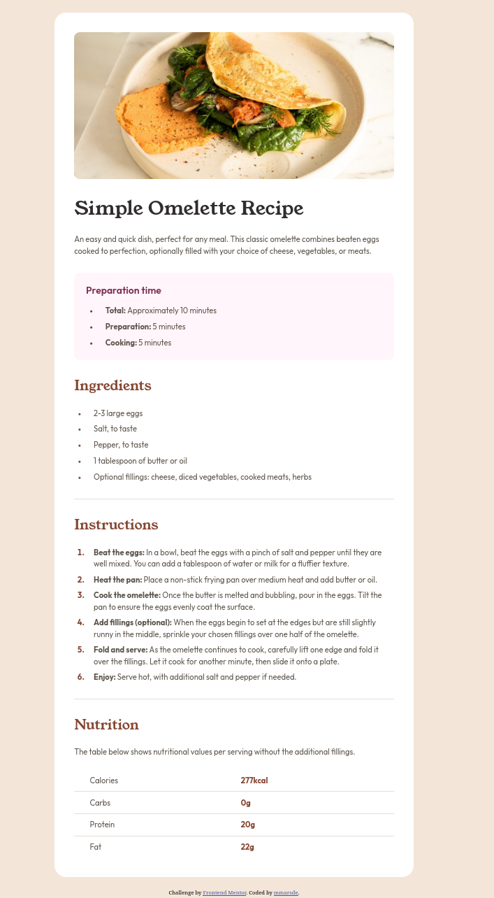
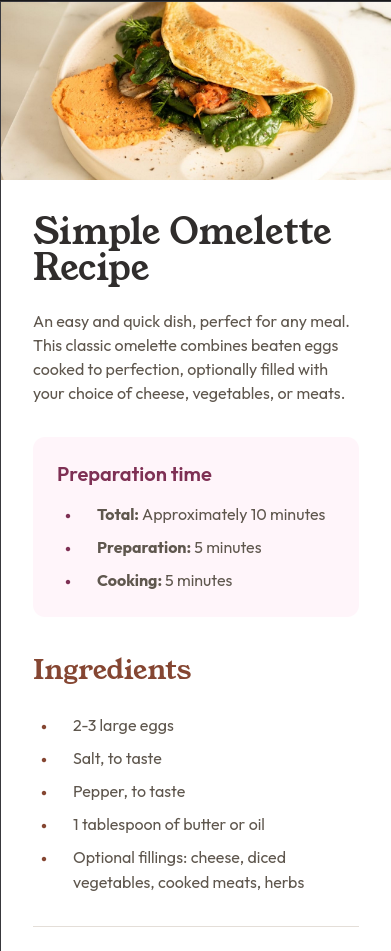
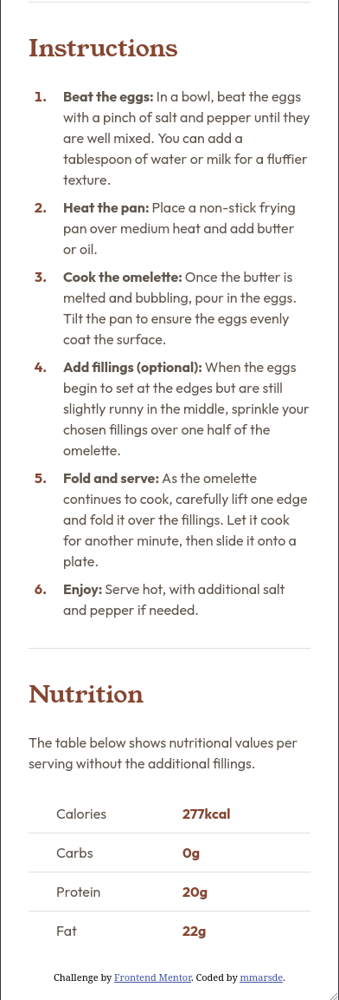

# Frontend Mentor - Recipe page solution

This is a solution to the [Recipe page challenge on Frontend Mentor](https://www.frontendmentor.io/challenges/recipe-page-KiTsR8QQKm). Frontend Mentor challenges help you improve your coding skills by building realistic projects.

## Table of contents

- [Frontend Mentor - Recipe page solution](#frontend-mentor---recipe-page-solution)
  - [Table of contents](#table-of-contents)
  - [Overview](#overview)
    - [Screenshots](#screenshots)
    - [Desktop](#desktop)
    - [Mobile](#mobile)
    - [Links](#links)
  - [My process](#my-process)
    - [Built with](#built-with)
    - [What I learned](#what-i-learned)
    - [Useful resources](#useful-resources)
  - [Author](#author)

## Overview

### Screenshots

### Desktop

### Mobile

### Links

- Live Site URL: [Frontend Mentors Recipe Page Solution](https://fe-mentors-recipe-page-mmars.netlify.app)

## My process

### Built with

- Semantic HTML5 markup
- CSS custom properties
- CSS Grid

### What I learned

I wanted to practice building a simple webpage with static content, using foundational web technologies (HTML5 and vanilla CSS) over frameworks.

The key takeaways for me were as follows:

- Structuring and presenting the content using semantic HTML elements.
  - This describes the meaning and purpose of the content, aiding in readability, SEO and accessibility. e.g. using `<table>` to structure the nutritional information in a tabular format on the recipe page.
- BEM (Block, Element, Modifier) - For consistent, readable CSS class naming conventions.
- CSS Custom properties - for code reuse and maintainable stylesheets.

### Useful resources

- [MDN Docs](https://developer.mozilla.org/en-US/docs/Web/CSS)
- [BEM](https://en.bem.info/methodology/)

## Author

- Frontend Mentor - [@mmarsde](https://www.frontendmentor.io/profile/mmarsde)
